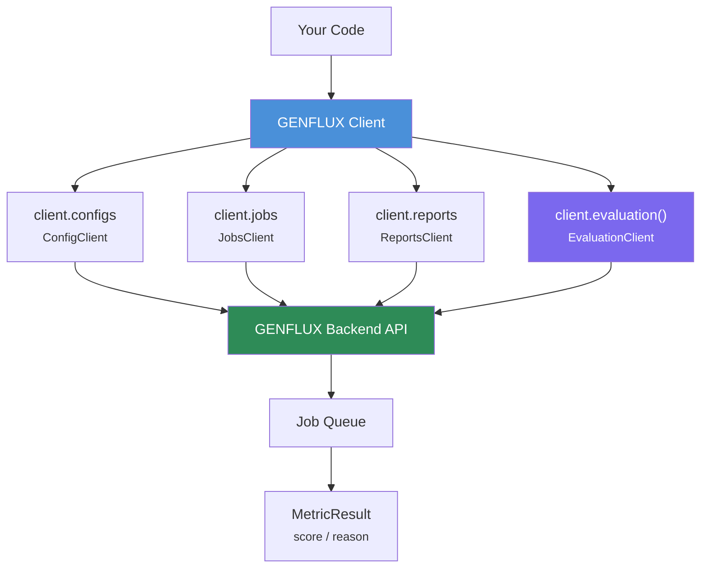

<p align="center">
  
  &nbsp;
  <picture>
    <source media="(prefers-color-scheme: dark)" srcset="assets/GENFLUX_logotype_w.png" width="320">
    <source media="(prefers-color-scheme: light)" srcset="assets/GENFLUX_logotype.png" width="320">
    
  </picture>
</p>

<p align="center">
  <strong>GENFLUX Python SDK</strong><br>
  GENFLUX Platform 公式 Python SDK。RAG システムの回答品質スコアリング、セキュリティテスト、ポリシーチェックを Python から実行できます。
</p>

[](https://github.com/elith-co-jp/genflux-python-sdk/releases/tag/v0.1.2)
[](https://www.python.org/downloads/)
[](LICENSE)

## ドキュメント

詳細な API 仕様・ワークフロー例は以下を参照してください。

- [API リファレンス](./docs/API_REFERENCE.md) — 全メソッド・モデル・例外の詳細
- [クイックスタート](./docs/QUICKSTART.md) — Config 不要で今すぐ試せるサンプル
- [ワークフロー](./docs/WORKFLOW.md) — バッチ評価、CI/CD 統合、エラーハンドリング

## Why GENFLUX

RAG システムを本番運用する際、「回答品質が十分か」「安全性に問題はないか」を継続的に検証する仕組みが不可欠です。

GENFLUX は **RAG の品質・安全性を数値で可視化** するプラットフォームです。この SDK を使って Python から直接評価を実行できます。

- **8 種類の評価メトリック** — Faithfulness、Hallucination、Toxicity など、RAG に必要な品質指標をワンライナーで計測
- **CI/CD 統合** — テストパイプラインに組み込み、品質劣化を自動検知（[ワークフロー例](./docs/WORKFLOW.md#cicd統合)）
- **セキュリティテスト** — GENFLUX Platform 上で Red Teaming による攻撃シミュレーションを実行し、脆弱性を事前に検出
- **ポリシーチェック** — GENFLUX Platform 上で AI 事業者ガイドライン準拠を自動検証

```python
from genflux import Genflux

client = Genflux()
result = client.evaluation().faithfulness(
    question="What is RAG?",
    answer="RAG is Retrieval-Augmented Generation.",
    contexts=["RAG combines retrieval and generation..."],
)
print(f"Faithfulness: {result.score}")  # 0.92
```

## できること

### RAG 回答品質の評価

8 種類のメトリックで RAG システムの回答品質をスコアリングできます。

```python
evaluator = client.evaluation()

# 回答が文脈に基づいているか（忠実性）
result = evaluator.faithfulness(question, answer, contexts)
print(result.score)   # 0.92
print(result.reason)  # スコアの根拠

# 幻覚（ハルシネーション）検出
result = evaluator.hallucination(question, answer, contexts)

# 有害性・偏見チェック
result = evaluator.toxicity(question, answer)
result = evaluator.bias(question, answer)
```

### 評価設定の管理

RAG API の接続情報・評価条件を Config として保存し、繰り返し利用できます。

```python
from genflux.models import ConfigCreate

config = client.configs.create(ConfigCreate(
    name="本番 RAG API",
    api_endpoint="https://your-rag-api.example.com/chat",
    auth_type="bearer",
    auth_token="your-token",
))

# 一覧取得・更新・削除
configs = client.configs.list()
client.configs.update(config.id, ConfigUpdate(name="新しい名前"))
client.configs.delete(config.id)
```

### 非同期ジョブの実行・監視

大規模な評価やセキュリティテストは非同期ジョブとして実行し、進捗をリアルタイムで追跡できます。

```python
job = client.jobs.create(
    execution_type="evaluation",
    config_id=config.id,
)

# 完了まで待機（プログレスバー付き）
completed = client.jobs.wait(job.id, timeout=600)
print(completed.results)

# ジョブの一覧・キャンセル
running = client.jobs.list(status="running")
client.jobs.cancel(job.id)
```

### 評価レポートの取得

ジョブ完了後、サマリーと詳細の 2 段階でレポートを取得できます。

```python
# サマリー: CI/CD ゲーティング向け
report = client.reports.get(report_id, view="summary")
print(report.summary.evaluation.success_rate)  # 0.95

# 詳細: 失敗ケースの分析・改善提案
report = client.reports.get(report_id, view="details")
for case in report.details.failed_cases:
    print(f"{case.category}: {case.reason}")
```

### CI/CD パイプライン統合

品質スコアに閾値を設定し、パイプラインの pass/fail を自動判定できます。

```python
result = evaluator.faithfulness(question, answer, contexts)
if result.score < 0.8:
    raise SystemExit(f"品質基準未達: faithfulness={result.score}")
```

## アーキテクチャ



| クライアント | アクセス方法 | 説明 |
|---|---|---|
| `Genflux` | `Genflux()` | メインクライアント（認証・サブクライアント管理） |
| `EvaluationClient` | `client.evaluation()` | 8 種類のメトリックによる評価実行 |
| `ConfigClient` | `client.configs` | RAG API 設定の CRUD |
| `JobsClient` | `client.jobs` | 非同期ジョブの作成・監視・キャンセル |
| `ReportsClient` | `client.reports` | 評価レポートの取得（サマリー/詳細） |

## インストール

```bash
pip install genflux
```

## クイックスタート

```python
from genflux import Genflux

client = Genflux()  # 環境変数 GENFLUX_API_KEY を使用

evaluator = client.evaluation()
result = evaluator.faithfulness(
    question="What is Python?",
    answer="Python is a programming language.",
    contexts=["Python is a high-level programming language."],
)

print(result.score)   # 0.95
print(result.reason)  # "The answer is based on the provided context."
```

API Key は明示的に渡すこともできます。

```python
client = Genflux(api_key="pk_xxx")
```

## 評価メトリック

```python
evaluator = client.evaluation()

# 個別に実行
result = evaluator.faithfulness(question, answer, contexts)

# 複数メトリックをまとめて実行
faith    = evaluator.faithfulness(question, answer, contexts)
halluc   = evaluator.hallucination(question, answer, contexts)
toxicity = evaluator.toxicity(question, answer)
```

| メトリック | 説明 | `contexts` | `ground_truth` | スコア |
|---|---|---|---|---|
| `faithfulness` | 回答が提供された文脈に基づいているか | 必須 | — | 0〜1（高いほど良い） |
| `answer_relevancy` | 回答が質問に適切に答えているか | 任意 | — | 0〜1（高いほど良い） |
| `contextual_relevancy` | 取得された文脈が質問に関連しているか | 必須 | — | 0〜1（高いほど良い） |
| `contextual_precision` | 関連性の高い文脈が上位にランクされているか | 必須 | — | 0〜1（高いほど良い） |
| `contextual_recall` | 回答の情報が文脈に帰属できるか | 必須 | 必須 | 0〜1（高いほど良い） |
| `hallucination` | 回答が文脈にない情報を含んでいるか | 必須 | — | 0〜1（低いほど良い） |
| `toxicity` | 回答に有害なコンテンツが含まれるか | 任意 | — | 0〜1（低いほど良い） |
| `bias` | 回答に偏見が含まれるか | 任意 | — | 0〜1（低いほど良い） |

## エラーハンドリング

```python
from genflux.exceptions import (
    AuthenticationError,
    RateLimitError,
    TimeoutError,
    JobFailedError,
)

try:
    result = evaluator.faithfulness(question, answer, contexts)
except AuthenticationError:
    # API Key が無効または未設定
    pass
except RateLimitError as e:
    # レート制限。e.retry_after 秒後にリトライ
    pass
except TimeoutError:
    # ジョブがタイムアウト
    pass
except JobFailedError as e:
    # ジョブ実行失敗。e.error_message で詳細を確認
    pass
```

| 例外 | 発生条件 |
|---|---|
| `AuthenticationError` | API Key が無効・未設定 |
| `RateLimitError` | リクエスト制限超過 |
| `ValidationError` | パラメータ不正 |
| `NotFoundError` | リソースが見つからない |
| `TimeoutError` | ジョブのタイムアウト |
| `JobFailedError` | ジョブ実行の失敗 |
| `ConfigNotFoundError` | 指定した Config が存在しない |

## 設定

| 環境変数 | 説明 | デフォルト |
|---|---|---|
| `GENFLUX_API_KEY` | 認証用 API Key | *(必須)* |
| `GENFLUX_ENVIRONMENT` | `"local"` / `"dev"` / `"prod"` | `"prod"` |
| `GENFLUX_API_BASE_URL` | ベース URL の上書き（最優先） | — |

API Key は [GENFLUX Platform](https://www.platform.genflux.jp/) から発行してください。

## サポート

- [GitHub Issues](https://github.com/elith-co-jp/genflux-python-sdk/issues)
- Email: `genflux-support@elith.jp`

## ライセンス

MIT License — 詳細は [LICENSE](LICENSE) を参照してください。
