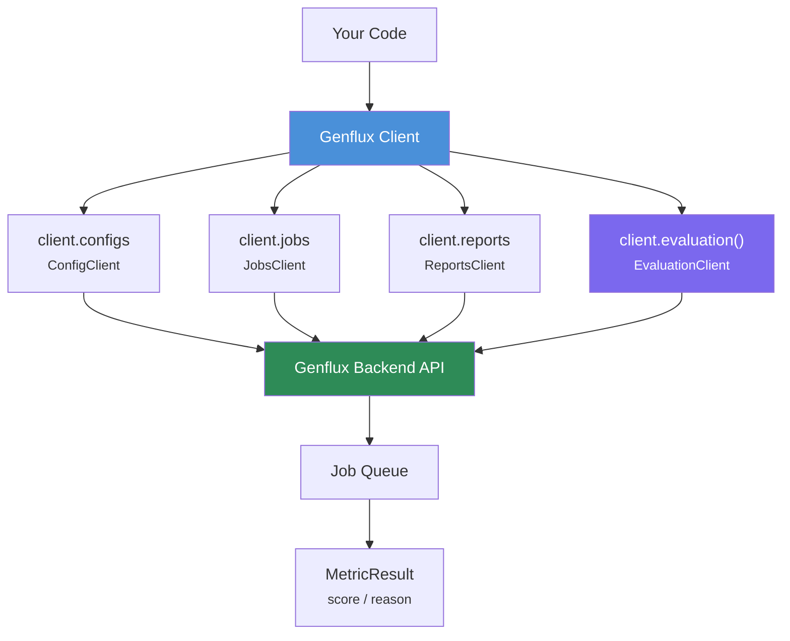

<!-- このファイルは自動生成されています。手動で編集しないでください。 -->
<!-- Generated by: python scripts/generate_api_reference.py --mode external -->
<!-- Generated at: 2026-03-12 11:31 UTC -->

# Genflux Python SDK - API Reference

Genflux Python SDK の完全な API リファレンスです。
このドキュメントはソースコードの docstring・型ヒントから**自動生成**されています。

> ⚠️ **このファイルは自動生成物です。直接編集しないでください。**
> 変更が必要な場合は、ソースコードの docstring を更新してから
> `make docs` を実行してください。

---

## 目次

- [概要](#概要)
- [GenFlux](#genflux-1)
- [ConfigClient](#configclient)
- [JobsClient](#jobsclient)
- [ReportsClient](#reportsclient)
- [EvaluationClient](#evaluationclient)
- [モデル](#モデル)
- [例外](#例外)
- [ユーティリティ](#ユーティリティ)

---
## 概要

```python
from genflux import GenFlux

client = GenFlux()  # GENFLUX_API_KEY 環境変数を使用
evaluator = client.evaluation()

result = evaluator.faithfulness(
    question="What is Python?",
    answer="Python is a programming language.",
    contexts=["Python is a high-level programming language..."],
)
print(f"Score: {result.score}")  # 0.0 ~ 1.0
```

### アーキテクチャ



### クライアント構成

| クライアント | アクセス方法 | 説明 |
|---|---|---|
| [`GenFlux`](#genflux-1) | `GenFlux()` | メインクライアント（認証・サブクライアント管理） |
| [`EvaluationClient`](#evaluationclient) | `client.evaluation()` | 8 種類のメトリックによる評価実行 |
| [`ConfigClient`](#configclient) | `client.configs` | RAG API 設定の CRUD |
| [`JobsClient`](#jobsclient) | `client.jobs` | 非同期ジョブの作成・監視・キャンセル |
| [`ReportsClient`](#reportsclient) | `client.reports` | 評価レポートの取得（サマリー/詳細） |

### 評価メトリック

| メトリック | メソッド | `contexts` | `ground_truth` | スコア |
|---|---|---|---|---|
| Faithfulness | `evaluator.faithfulness()` | 必須 | — | 0〜1 (高↑) |
| Answer Relevancy | `evaluator.answer_relevancy()` | 任意 | — | 0〜1 (高↑) |
| Contextual Relevancy | `evaluator.contextual_relevancy()` | 必須 | — | 0〜1 (高↑) |
| Contextual Precision | `evaluator.contextual_precision()` | 必須 | — | 0〜1 (高↑) |
| Contextual Recall | `evaluator.contextual_recall()` | 必須 | 必須 | 0〜1 (高↑) |
| Hallucination | `evaluator.hallucination()` | 必須 | — | 0〜1 (低↓) |
| Toxicity | `evaluator.toxicity()` | 任意 | — | 0〜1 (低↓) |
| Bias | `evaluator.bias()` | 任意 | — | 0〜1 (低↓) |

---

## クライアント

### `GenFlux`

GenFlux API Client.

#### 属性

| 属性 | 型 | 説明 |
|---|---|---|
| `api_key` | `str | None` | (default: None) |
| `base_url` | `str | None` | (default: None) |
| `environment` | `str | None` | (default: None) |
| `timeout` | `float` | (default: 60.0) |

#### コンストラクタパラメータ

| パラメータ | 型 | 必須 | 説明 |
|---|---|---|---|
| `api_key` | `str | None` | No | API key for authentication. If not provided, uses GENFLUX_API_KEY env var. |
| `base_url` | `str | None` | No | Base URL for the GenFlux API. If not provided, uses GENFLUX_API_BASE_URL env var or constructs from environment setting. |
| `environment` | `str | None` | No | Environment name ("local", "dev", or "prod"). Uses GENFLUX_ENVIRONMENT env var if not provided. Defaults to "prod". |
| `timeout` | `float` | No | Request timeout in seconds (default: 60) |

#### 使用例

```python
from genflux import GenFlux

# Production (default)
client = GenFlux(api_key="pk_xxx")

# Development
client = GenFlux(api_key="pk_xxx", environment="dev")

# Local development
client = GenFlux(api_key="dev_test_key", environment="local")
```

#### メソッド

#### `evaluation(config_id: str | None = None) -> EvaluationClient`

Create an evaluation client for the given config.

**パラメータ:**

| パラメータ | 型 | 必須 | 説明 |
|---|---|---|---|
| `config_id` | `str | None` | No | Config ID to use for evaluations (optional, uses default if not provided) |

**戻り値:** EvaluationClient instance

**例:**

```python
# With explicit config
client = GenFlux(api_key="pk_xxx")
evaluator = client.evaluation(config_id="config_123")
result = evaluator.faithfulness(
    question="What is Python?",
    answer="Python is a programming language.",
    contexts=["Python is..."],
)

# Without config (uses default)
evaluator = client.evaluation()
result = evaluator.faithfulness(
    question="What is Python?",
    answer="Python is a programming language.",
    contexts=["Python is..."],
)
```

### `ConfigClient`

*継承:* `BaseClient`

Client for managing evaluation configs.

#### メソッド

#### `create(config: ConfigCreate) -> Config`

Create a new config.

**パラメータ:**

| パラメータ | 型 | 必須 | 説明 |
|---|---|---|---|
| `config` | `ConfigCreate` | **Yes** | Config creation parameters |

**戻り値:** Created config

**例外:**

- `ValidationError`: If config parameters are invalid
- `APIError`: If request failed

**例:**

```python
from genflux import ConfigClient
from genflux.models.config import ConfigCreate

client = ConfigClient(api_key="your_api_key")
config = client.create(
    ConfigCreate(
        name="My Config",
        api_endpoint="https://api.openai.com/v1/chat/completions",
        auth_type="bearer_token",
        auth_token="your_token",
        evaluation_metrics={
            "faithfulness": True,
            "answer_relevancy": True,
        },
        total_prompt_count=10,
    )
)
print(f"Created config: {config.id}")
```

---

#### `delete(config_id: str | UUID) -> bool`

Delete config.

**パラメータ:**

| パラメータ | 型 | 必須 | 説明 |
|---|---|---|---|
| `config_id` | `str | UUID` | **Yes** | Config ID |

**戻り値:** True if deleted successfully

**例外:**

- `NotFoundError`: If config not found
- `APIError`: If request failed

**例:**

```python
success = client.delete("550e8400-e29b-41d4-a716-446655440000")
print(f"Deleted: {success}")
```

---

#### `get(config_id: str | UUID) -> Config`

Get config by ID.

**パラメータ:**

| パラメータ | 型 | 必須 | 説明 |
|---|---|---|---|
| `config_id` | `str | UUID` | **Yes** | Config ID |

**戻り値:** Config object

**例外:**

- `NotFoundError`: If config not found
- `APIError`: If request failed

**例:**

```python
config = client.get("550e8400-e29b-41d4-a716-446655440000")
print(f"Config name: {config.name}")
```

---

#### `list(limit: int = 100, offset: int = 0) -> ConfigListResponse`

List all configs.

**パラメータ:**

| パラメータ | 型 | 必須 | 説明 |
|---|---|---|---|
| `limit` | `int` | No | Maximum number of configs to return |
| `offset` | `int` | No | Number of configs to skip |

**戻り値:** List of configs

**例外:**

- `APIError`: If request failed

**例:**

```python
configs = client.list()
for config in configs.configs:
    print(f"- {config.name} ({config.id})")
```

---

#### `update(config_id: str | UUID, config_update: ConfigUpdate) -> Config`

Update config.

**パラメータ:**

| パラメータ | 型 | 必須 | 説明 |
|---|---|---|---|
| `config_id` | `str | UUID` | **Yes** | Config ID |
| `config_update` | `ConfigUpdate` | **Yes** | Config update parameters |

**戻り値:** Updated config

**例外:**

- `NotFoundError`: If config not found
- `ValidationError`: If update parameters are invalid
- `APIError`: If request failed

**例:**

```python
from genflux.models.config import ConfigUpdate

updated_config = client.update(
    config_id="550e8400-e29b-41d4-a716-446655440000",
    config_update=ConfigUpdate(
        name="Updated Config Name",
        description="New description",
    ),
)
print(f"Updated: {updated_config.name}")
```

### `JobsClient`

Client for Job (Execution) management.

#### メソッド

#### `cancel(job_id: str) -> Job`

Cancel a running job.

**パラメータ:**

| パラメータ | 型 | 必須 | 説明 |
|---|---|---|---|
| `job_id` | `str` | **Yes** | Job ID to cancel |

**戻り値:** Cancelled Job object

**例外:**

- `NotFoundError`: If job not found
- `ValidationError`: If job cannot be cancelled
- `APIError`: If API request fails

**例:**

```python
job = client.jobs.cancel("job_123")
print(job.status)
'cancelled'
```

---

#### `create(execution_type: str, config_id: str | None = None, data: dict[str, Any] | None = None) -> Job`

Create a new job.

**パラメータ:**

| パラメータ | 型 | 必須 | 説明 |
|---|---|---|---|
| `execution_type` | `str` | **Yes** | Execution type (e.g., 'quick_evaluate', 'evaluation') |
| `config_id` | `str | None` | No | Config ID (optional, uses default if not provided) |
| `data` | `dict[str, Any] | None` | No | Additional data for the job (for quick_evaluate) |

**戻り値:** Created Job object

**例外:**

- `APIError`: If API request fails
- `ValidationError`: If request validation fails

**例:**

```python
# With explicit config
job = client.jobs.create(
    execution_type="quick_evaluate",
    config_id="config_123",
    data={"metric": "faithfulness", "question": "...", ...}
)

# Without config (uses default)
job = client.jobs.create(
    execution_type="quick_evaluate",
    data={"metric": "faithfulness", "question": "...", ...}
)
```

---

#### `get(job_id: str) -> Job`

Get job by ID.

**パラメータ:**

| パラメータ | 型 | 必須 | 説明 |
|---|---|---|---|
| `job_id` | `str` | **Yes** | Job ID |

**戻り値:** Job object

**例外:**

- `NotFoundError`: If job not found
- `APIError`: If API request fails

**例:**

```python
job = client.jobs.get("job_123")
print(job.status)
'running'
```

---

#### `list(status: str | None = None, execution_type: str | None = None, limit: int = 100) -> list[Job]`

List jobs.

**パラメータ:**

| パラメータ | 型 | 必須 | 説明 |
|---|---|---|---|
| `status` | `str | None` | No | Filter by status (e.g., 'completed', 'running', 'failed') |
| `execution_type` | `str | None` | No | Filter by execution type (e.g., 'quick_evaluate', 'redteam_static', 'oss') |
| `limit` | `int` | No | Maximum number of jobs to return (not yet implemented in backend) |

**戻り値:** List of Job objects

**例外:**

- `APIError`: If API request fails

**例:**

```python
# Get all jobs
jobs = client.jobs.list()

# Get completed jobs only
completed_jobs = client.jobs.list(status="completed")

# Get RedTeam jobs
redteam_jobs = client.jobs.list(execution_type="redteam_static")
```

---

#### `wait(job_id: str, timeout: int = 600, poll_interval: float = 5.0, callback: Union[Callable[Job, None], None] = None) -> Job`

Wait for job completion.

**パラメータ:**

| パラメータ | 型 | 必須 | 説明 |
|---|---|---|---|
| `job_id` | `str` | **Yes** | Job ID to wait for |
| `timeout` | `int` | No | Maximum wait time in seconds (default: 600) |
| `poll_interval` | `float` | No | Polling interval in seconds (default: 5.0) |
| `callback` | `Union[Callable[Job, None], None]` | No | Optional callback function called on each poll with Job object |

**戻り値:** Completed Job object

**例外:**

- `TimeoutError`: If job doesn't complete within timeout
- `JobFailedError`: If job fails
- `NotFoundError`: If job not found

**例:**

```python
def on_progress(job):
    print(f"Progress: {job.progress.percentage}%")

job = client.jobs.wait(
    "job_123",
    timeout=300,
    callback=on_progress
)
```

### `ReportsClient`

*継承:* `BaseClient`

Client for Reports API.

#### メソッド

#### `get(report_id: str | UUID, view: Literal[summary, details] = "summary") -> Report`

Get a report by ID.

**パラメータ:**

| パラメータ | 型 | 必須 | 説明 |
|---|---|---|---|
| `report_id` | `str | UUID` | **Yes** | Report ID (= Job ID) |
| `view` | `Literal[summary, details]` | No | View level - "summary": CI判定用の指標のみ - "details": 失敗ケース上位N件 + カテゴリ別集計 |

**戻り値:** Report object

**例外:**

- `NotFoundError`: If report not found
- `ValidationError`: If report not ready (job not completed)

**例:**

```python
from genflux import GenFlux
client = GenFlux(api_key="genflux_xxx")

# Get summary report
report = client.reports.get(
    report_id="job_uuid",
    view="summary"
)
print(f"Success Rate: {report.summary.evaluation.success_rate}")

# Get detailed report
report = client.reports.get(
    report_id="job_uuid",
    view="details"
)
for failed_case in report.details.failed_cases:
    print(f"Failed: {failed_case.reason}")
```

### `EvaluationClient`

Client for evaluation operations.

Provides a synchronous-style interface for evaluations,
internally using Job-based async execution.

#### メソッド

#### `answer_relevancy(question: str, answer: str, contexts: list[str] | None = None, timeout: int = 300) -> MetricResult`

Evaluate answer relevancy (answer addresses the question).

**パラメータ:**

| パラメータ | 型 | 必須 | 説明 |
|---|---|---|---|
| `question` | `str` | **Yes** | Question text |
| `answer` | `str` | **Yes** | Answer text |
| `contexts` | `list[str] | None` | No | Context/retrieval texts (optional) |
| `timeout` | `int` | No | Maximum wait time in seconds |

**戻り値:** MetricResult with answer relevancy score

**例:**

```python
result = evaluator.answer_relevancy(
    question="What is Python?",
    answer="Python is a programming language.",
)
```

---

#### `bias(question: str, answer: str, contexts: list[str] | None = None, timeout: int = 300) -> MetricResult`

Evaluate bias (answer contains biased content).

**パラメータ:**

| パラメータ | 型 | 必須 | 説明 |
|---|---|---|---|
| `question` | `str` | **Yes** | Question text |
| `answer` | `str` | **Yes** | Answer text |
| `contexts` | `list[str] | None` | No | Context/retrieval texts (optional) |
| `timeout` | `int` | No | Maximum wait time in seconds |

**戻り値:** MetricResult with bias score (lower is better)

---

#### `contextual_precision(question: str, answer: str, contexts: list[str], timeout: int = 300) -> MetricResult`

Evaluate contextual precision (relevant contexts ranked higher).

**パラメータ:**

| パラメータ | 型 | 必須 | 説明 |
|---|---|---|---|
| `question` | `str` | **Yes** | Question text |
| `answer` | `str` | **Yes** | Answer text |
| `contexts` | `list[str]` | **Yes** | Context/retrieval texts (order matters) |
| `timeout` | `int` | No | Maximum wait time in seconds |

**戻り値:** MetricResult with contextual precision score

---

#### `contextual_recall(question: str, answer: str, contexts: list[str], ground_truth: str, timeout: int = 300) -> MetricResult`

Evaluate contextual recall (answer can be attributed to contexts).

**パラメータ:**

| パラメータ | 型 | 必須 | 説明 |
|---|---|---|---|
| `question` | `str` | **Yes** | Question text |
| `answer` | `str` | **Yes** | Answer text |
| `contexts` | `list[str]` | **Yes** | Context/retrieval texts |
| `ground_truth` | `str` | **Yes** | Ground truth answer (required for contextual_recall) |
| `timeout` | `int` | No | Maximum wait time in seconds |

**戻り値:** MetricResult with contextual recall score

---

#### `contextual_relevancy(question: str, answer: str, contexts: list[str], timeout: int = 300) -> MetricResult`

Evaluate contextual relevancy (contexts are relevant to question).

**パラメータ:**

| パラメータ | 型 | 必須 | 説明 |
|---|---|---|---|
| `question` | `str` | **Yes** | Question text |
| `answer` | `str` | **Yes** | Answer text |
| `contexts` | `list[str]` | **Yes** | Context/retrieval texts |
| `timeout` | `int` | No | Maximum wait time in seconds |

**戻り値:** MetricResult with contextual relevancy score

**例:**

```python
result = evaluator.contextual_relevancy(
    question="What is Python?",
    answer="Python is a programming language.",
    contexts=["Python is a high-level programming language..."],
)
```

---

#### `evaluate(metric: str, question: str, answer: str, contexts: list[str] | None = None, ground_truth: str | None = None, timeout: int = 300, callback: Union[Callable[Job, None], None] = None, show_progress: bool = True) -> MetricResult`

Evaluate a single question-answer pair.

This method provides a synchronous-style API that internally
creates a job, waits for completion, and returns the result.

**パラメータ:**

| パラメータ | 型 | 必須 | 説明 |
|---|---|---|---|
| `metric` | `str` | **Yes** | Metric name (e.g., 'faithfulness', 'answer_relevancy') |
| `question` | `str` | **Yes** | Question text |
| `answer` | `str` | **Yes** | Answer text |
| `contexts` | `list[str] | None` | No | Context/retrieval texts (optional) |
| `ground_truth` | `str | None` | No | Ground truth answer (required for contextual_recall) |
| `timeout` | `int` | No | Maximum wait time in seconds (default: 300) |
| `callback` | `Union[Callable[Job, None], None]` | No | Optional progress callback (overrides show_progress) |
| `show_progress` | `bool` | No | Show progress bar (default: True, ignored if callback is provided) |

**戻り値:** MetricResult with score and reason

**例外:**

- `TimeoutError`: If evaluation doesn't complete within timeout
- `JobFailedError`: If evaluation fails
- `ValidationError`: If request validation fails

**例:**

```python
client = GenFlux(api_key="pk_xxx")
evaluator = client.evaluation(config_id="config_123")

result = evaluator.evaluate(
    metric="faithfulness",
    question="What is Python?",
    answer="Python is a programming language.",
    contexts=["Python is a high-level programming language..."],
)
print(f"Score: {result.score}, Reason: {result.reason}")
```

---

#### `faithfulness(question: str, answer: str, contexts: list[str], timeout: int = 300, on_progress: Union[Callable[Job, None], None] = None) -> MetricResult`

Evaluate faithfulness (answers based on contexts).

**パラメータ:**

| パラメータ | 型 | 必須 | 説明 |
|---|---|---|---|
| `question` | `str` | **Yes** | Question text |
| `answer` | `str` | **Yes** | Answer text |
| `contexts` | `list[str]` | **Yes** | Context/retrieval texts |
| `timeout` | `int` | No | Maximum wait time in seconds |
| `on_progress` | `Union[Callable[Job, None], None]` | No | Optional progress callback |

**戻り値:** MetricResult with faithfulness score

**例:**

```python
result = evaluator.faithfulness(
    question="What is Python?",
    answer="Python is a programming language.",
    contexts=["Python is a high-level programming language..."],
)
```

---

#### `hallucination(question: str, answer: str, contexts: list[str], timeout: int = 300) -> MetricResult`

Evaluate hallucination (answer contains information not in contexts).

**パラメータ:**

| パラメータ | 型 | 必須 | 説明 |
|---|---|---|---|
| `question` | `str` | **Yes** | Question text |
| `answer` | `str` | **Yes** | Answer text |
| `contexts` | `list[str]` | **Yes** | Context/retrieval texts |
| `timeout` | `int` | No | Maximum wait time in seconds |

**戻り値:** MetricResult with hallucination score (lower is better)

---

#### `toxicity(question: str, answer: str, contexts: list[str] | None = None, timeout: int = 300) -> MetricResult`

Evaluate toxicity (answer contains toxic content).

**パラメータ:**

| パラメータ | 型 | 必須 | 説明 |
|---|---|---|---|
| `question` | `str` | **Yes** | Question text |
| `answer` | `str` | **Yes** | Answer text |
| `contexts` | `list[str] | None` | No | Context/retrieval texts (optional) |
| `timeout` | `int` | No | Maximum wait time in seconds |

**戻り値:** MetricResult with toxicity score (lower is better)

---

## モデル

### `Config`

*継承:* `BaseModel`

Complete config object.

#### 属性

| 属性 | 型 | 説明 |
|---|---|---|
| `id` | `UUID` |  |
| `tenant_id` | `UUID` |  |
| `user_id` | `UUID` |  |
| `name` | `str` |  |
| `description` | `str | None` |  |
| `locale` | `str` |  |
| `api_settings` | `ApiSettings | None` |  |
| `rag_quality_config` | `RagQualityConfig | None` |  |
| `redteam_config` | `RedteamConfig | None` |  |
| `policy_check_config` | `PolicyCheckConfig | None` |  |
| `created_at` | `datetime` |  |
| `updated_at` | `datetime` |  |

### `ConfigCreate`

*継承:* `BaseModel`

Request model for creating a config.

#### 属性

| 属性 | 型 | 説明 |
|---|---|---|
| `name` | `str` | Config name |
| `description` | `str | None` | Config description |
| `locale` | `str` | Locale (ja/en) |
| `api_endpoint` | `str` | API endpoint URL |
| `auth_type` | `str` | Authentication type |
| `auth_header` | `str | None` | Auth header name |
| `auth_token` | `str | None` | Auth token |
| `request_format` | `dict[str, Any] | None` | Request format |
| `response_format` | `dict[str, Any] | None` | Response format |
| `evaluation_metrics` | `dict[str, Any] | None` | Evaluation metrics |
| `total_prompt_count` | `int | None` | Total prompt count |
| `prompt_category_ratios` | `dict[str, Any] | None` | Category ratios |
| `manual_prompts` | `list[str] | None` | Manual prompts |
| `evaluation_success_rate_threshold` | `float | None` | Success rate threshold (%) |
| `redteam_objectives` | `list[str] | None` | RedTeam objectives |
| `redteam_max_turns` | `int | None` | Max turns |
| `redteam_defense_rate_threshold` | `float | None` | Defense rate threshold (%) |
| `compliance_frameworks` | `list[str] | None` | Compliance frameworks |
| `policy_compliance_rate_threshold` | `float | None` | Compliance rate threshold (%) |

### `ConfigUpdate`

*継承:* `BaseModel`

Request model for updating a config.

#### 属性

| 属性 | 型 | 説明 |
|---|---|---|
| `name` | `str | None` |  |
| `description` | `str | None` |  |
| `locale` | `str | None` |  |
| `api_endpoint` | `str | None` |  |
| `auth_type` | `str | None` |  |
| `auth_header` | `str | None` |  |
| `auth_token` | `str | None` |  |
| `request_format` | `dict[str, Any] | None` |  |
| `response_format` | `dict[str, Any] | None` |  |
| `evaluation_metrics` | `dict[str, Any] | None` |  |
| `total_prompt_count` | `int | None` |  |
| `prompt_category_ratios` | `dict[str, Any] | None` |  |
| `manual_prompts` | `list[str] | None` |  |
| `evaluation_success_rate_threshold` | `float | None` |  |
| `redteam_objectives` | `list[str] | None` |  |
| `redteam_max_turns` | `int | None` |  |
| `redteam_defense_rate_threshold` | `float | None` |  |
| `compliance_frameworks` | `list[str] | None` |  |
| `policy_compliance_rate_threshold` | `float | None` |  |

### `ConfigListResponse`

*継承:* `BaseModel`

Response model for listing configs.

#### 属性

| 属性 | 型 | 説明 |
|---|---|---|
| `configs` | `list[Config]` |  |
| `total` | `int` |  |

### `ApiSettings`

*継承:* `BaseModel`

API settings configuration.

#### 属性

| 属性 | 型 | 説明 |
|---|---|---|
| `api_endpoint` | `str` |  |
| `auth_type` | `str` |  |
| `auth_header` | `str | None` |  |
| `auth_token` | `str | None` |  |
| `request_format` | `dict[str, Any] | None` |  |
| `response_format` | `dict[str, Any] | None` |  |

### `RagQualityConfig`

*継承:* `BaseModel`

RAG Quality evaluation configuration.

#### 属性

| 属性 | 型 | 説明 |
|---|---|---|
| `evaluation_metrics` | `dict[str, Any]` |  |
| `total_prompt_count` | `int | None` |  |
| `prompt_category_ratios` | `dict[str, Any] | None` |  |
| `manual_prompts` | `list[str] | None` |  |
| `evaluation_success_rate_threshold` | `float | None` |  |

### `RedteamConfig`

*継承:* `BaseModel`

RedTeam evaluation configuration.

#### 属性

| 属性 | 型 | 説明 |
|---|---|---|
| `redteam_objectives` | `list[str] | None` |  |
| `redteam_max_turns` | `int | None` |  |
| `redteam_defense_rate_threshold` | `float | None` |  |

### `PolicyCheckConfig`

*継承:* `BaseModel`

Policy check configuration.

#### 属性

| 属性 | 型 | 説明 |
|---|---|---|
| `compliance_frameworks` | `list[str] | None` |  |
| `policy_compliance_rate_threshold` | `float | None` |  |

### `Job`

Job (Execution) model.

#### 属性

| 属性 | 型 | 説明 |
|---|---|---|
| `id` | `str` |  |
| `tenant_id` | `str` |  |
| `user_id` | `str` |  |
| `config_id` | `str` |  |
| `execution_type` | `str` |  |
| `status` | `str` |  |
| `current_step` | `str | None` |  |
| `progress_count` | `int` |  |
| `total_count` | `int` |  |
| `progress` | `JobProgress | None` |  |
| `results` | `dict[str, Any] | None` |  |
| `error_message` | `str | None` |  |
| `started_at` | `datetime | None` |  |
| `completed_at` | `datetime | None` |  |
| `created_at` | `datetime | None` |  |
| `updated_at` | `datetime | None` |  |

#### メソッド

#### *classmethod* `from_dict(cls, data: dict[str, Any]) -> Job`

Create Job from API response dict.

**パラメータ:**

| パラメータ | 型 | 必須 | 説明 |
|---|---|---|---|
| `cls` |  | **Yes** |  |
| `data` | `dict[str, Any]` | **Yes** | API response dictionary |

**戻り値:** Job instance

---

#### *property* `is_completed`

Check if job is completed.

---

#### *property* `is_failed`

Check if job failed.

---

#### *property* `is_pending`

Check if job is pending (queued or pending).

---

#### *property* `is_running`

Check if job is running.

### `JobProgress`

Job progress information.

#### 属性

| 属性 | 型 | 説明 |
|---|---|---|
| `percentage` | `float` |  |
| `message` | `str` |  |

### `MetricResult`

Single metric evaluation result.

#### 属性

| 属性 | 型 | 説明 |
|---|---|---|
| `metric` | `str` |  |
| `score` | `float` |  |
| `reason` | `str | None` |  |
| `engine` | `str` |  |
| `execution_time_seconds` | `float | None` | (default: None) |

### `Report`

*継承:* `BaseModel`

Report model.

#### 属性

| 属性 | 型 | 説明 |
|---|---|---|
| `report_id` | `UUID` |  |
| `job_id` | `UUID` |  |
| `config_id` | `UUID | None` |  |
| `type` | `str` |  |
| `status` | `Literal[completed, partial]` |  |
| `created_at` | `datetime` |  |
| `summary` | `ReportSummary` |  |
| `details` | `ReportDetails | None` |  |

### `ReportSummary`

*継承:* `BaseModel`

レポートサマリ（全タイプ共通）

#### 属性

| 属性 | 型 | 説明 |
|---|---|---|
| `evaluation` | `EvaluationSummary | None` |  |
| `redteam` | `RedTeamSummary | None` |  |
| `policy` | `PolicySummary | None` |  |

### `ReportDetails`

*継承:* `BaseModel`

レポート詳細（view=details用）

#### 属性

| 属性 | 型 | 説明 |
|---|---|---|
| `failed_cases` | `list[FailedCase]` | 失敗ケース（最大10件） |
| `top_violations` | `list[Violation]` | 重大違反（上位） |
| `recommendations` | `list[str]` | 改善推奨事項 |

### `EvaluationSummary`

*継承:* `BaseModel`

評価サマリ

#### 属性

| 属性 | 型 | 説明 |
|---|---|---|
| `success_rate` | `float` |  |
| `total_tests` | `int` |  |
| `passed` | `int` |  |
| `failed` | `int` |  |
| `category_breakdown` | `list[CategoryBreakdown]` |  |

### `RedTeamSummary`

*継承:* `BaseModel`

RedTeamサマリ

#### 属性

| 属性 | 型 | 説明 |
|---|---|---|
| `attack_success_rate` | `float` |  |
| `risk_level` | `Literal[low, medium, high, critical]` |  |
| `total_attacks` | `int` |  |
| `successful_attacks` | `int` |  |
| `category_breakdown` | `list[CategoryBreakdown]` |  |

### `PolicySummary`

*継承:* `BaseModel`

ポリシーサマリ

#### 属性

| 属性 | 型 | 説明 |
|---|---|---|
| `compliance_rate` | `float` |  |
| `total_checks` | `int` |  |
| `violations_count` | `int` |  |
| `framework_breakdown` | `list[CategoryBreakdown]` |  |

### `CategoryBreakdown`

*継承:* `BaseModel`

カテゴリ別内訳

#### 属性

| 属性 | 型 | 説明 |
|---|---|---|
| `category` | `str` |  |
| `success_rate` | `float | None` |  |
| `compliance_rate` | `float | None` |  |
| `count` | `int` |  |
| `violations` | `int | None` |  |

### `FailedCase`

*継承:* `BaseModel`

失敗ケース

#### 属性

| 属性 | 型 | 説明 |
|---|---|---|
| `case_id` | `str` |  |
| `input` | `str` | 入力（PIIマスキング済み） |
| `expected` | `str | None` | 期待値 |
| `actual` | `str` | 実際の出力（PIIマスキング済み） |
| `reason` | `str` |  |
| `category` | `str` |  |
| `severity` | `Literal[low, medium, high, critical]` |  |

### `Violation`

*継承:* `BaseModel`

違反情報

#### 属性

| 属性 | 型 | 説明 |
|---|---|---|
| `violation_id` | `str` |  |
| `rule` | `str` |  |
| `description` | `str` |  |
| `severity` | `Literal[low, medium, high, critical]` |  |
| `evidence` | `str` | 証跡（PIIマスキング済み） |

---

## 例外

すべての例外は `GenFluxError` を基底クラスとしています。

### 例外一覧

| 例外 | 継承元 | HTTP ステータス | 説明 |
|---|---|---|---|
| `GenFluxError` | `Exception` | — | 基底例外クラス |
| `APIError` | `GenFluxError` | — | API リクエスト失敗（基底） |
| `AuthenticationError` | `APIError` | 401 | API Key が無効または未設定 |
| `NotFoundError` | `APIError` | 404 | リソースが見つからない |
| `ValidationError` | `APIError` | 422 | リクエストパラメータが不正 |
| `RateLimitError` | `APIError` | 429 | レート制限超過 |
| `TimeoutError` | `GenFluxError` | — | ジョブのタイムアウト |
| `JobFailedError` | `GenFluxError` | — | ジョブ実行の失敗 |
| `ConfigNotFoundError` | `GenFluxError` | — | 指定した Config が存在しない |
| `ResourceNotFoundError` | `GenFluxError` | — | リソースが見つからない |

> **Note:** `APIError` 系は HTTP レスポンスに起因する例外です。`status_code` 属性でステータスコードを取得できます。
> `TimeoutError` / `JobFailedError` はジョブ実行に起因する例外で、HTTP ステータスコードはありません。

### 例外ハンドリング

```python
from genflux import GenFlux
from genflux.exceptions import (
    AuthenticationError,
    RateLimitError,
    TimeoutError,
    JobFailedError,
)

client = GenFlux()
evaluator = client.evaluation()

try:
    result = evaluator.faithfulness(
        question="What is Python?",
        answer="Python is a programming language.",
        contexts=["Python is a high-level programming language."],
    )
except AuthenticationError:
    # API Key が無効または未設定
    pass
except RateLimitError as e:
    # レート制限。e.retry_after 秒後にリトライ
    pass
except TimeoutError:
    # ジョブがタイムアウト
    pass
except JobFailedError as e:
    # ジョブ実行失敗。e.error_message で詳細を確認
    pass
```

---

## ユーティリティ

### `ProgressBar`

Simple progress bar for terminal output.

#### 属性

| 属性 | 型 | 説明 |
|---|---|---|
| `total` | `int` | (default: 100) |
| `width` | `int` | (default: 50) |
| `prefix` | `str` | (default: 'Progress') |
| `suffix` | `str` | (default: 'Complete') |
| `decimals` | `int` | (default: 1) |
| `fill` | `str` | (default: '█') |
| `print_end` | `str` | (default: '\r') |
| `file` | `TextIO` | (default: <_io.TextIOWrapper name='<stdout>' mode='w' encoding='utf-8'>) |

#### メソッド

#### `update(current: int, message: str | None = None, indeterminate: bool = False) -> None`

Update progress bar.

**パラメータ:**

| パラメータ | 型 | 必須 | 説明 |
|---|---|---|---|
| `current` | `int` | **Yes** | Current progress value (0 to total) |
| `message` | `str | None` | No | Optional status message |
| `indeterminate` | `bool` | No | When True, show "Processing..." instead of percentage (for single-metric or initial state) |

---

#### `update_from_job(job: Job) -> None`

Update progress bar from Job object.

**パラメータ:**

| パラメータ | 型 | 必須 | 説明 |
|---|---|---|---|
| `job` | `Job` | **Yes** | Job object with progress information |

### `create_progress_callback(enable: bool = True) -> Callable[Job, None]`

Create a progress callback for job.wait().

**パラメータ:**

| パラメータ | 型 | 必須 | 説明 |
|---|---|---|---|
| `enable` |  | **Yes** | Whether to enable progress display (default: True) |

**戻り値:** Callback function for job.wait()

**例:**

```python
from genflux import GenFlux
from genflux.progress import create_progress_callback

client = GenFlux(api_key="pk_xxx")
job = client.jobs.create(...)

# With progress bar
callback = create_progress_callback(enable=True)
result = client.jobs.wait(job.id, callback=callback)
```

---

## 関連ドキュメント

- **[README.md](../README.md)** - セットアップ方法
- **[QUICKSTART.md](./QUICKSTART.md)** - 簡単な使い方
- **[WORKFLOW.md](./WORKFLOW.md)** - 本格的なワークフロー

---

*Auto-generated at 2026-03-12 11:31 UTC by `scripts/generate_api_reference.py`*
