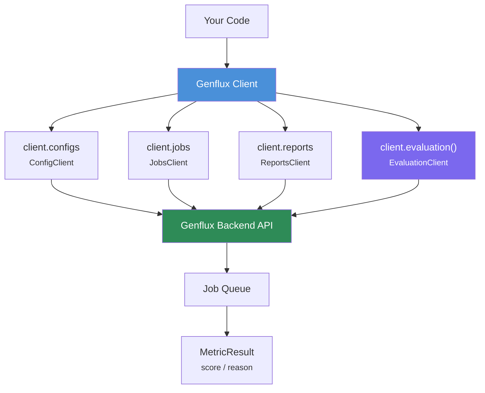

<!-- このファイルは自動生成されています。手動で編集しないでください。 -->
<!-- Generated by: python scripts/generate_api_reference.py --mode external -->
<!-- Generated at: 2026-03-17 06:04 UTC -->

# Genflux Python SDK - API Reference

Genflux Python SDK の完全な API リファレンスです。
このドキュメントはソースコードの docstring・型ヒントから**自動生成**されています。

> ⚠️ **このファイルは自動生成物です。直接編集しないでください。**
> 変更が必要な場合は、ソースコードの docstring を更新してから
> `make docs` を実行してください。

---

## 目次

- [1. 概要](#1-概要)
- [2. クライアント](#2-クライアント)
  - [2.1 GenFlux](#21-genflux)
  - [2.2 ConfigClient](#22-configclient)
  - [2.3 JobsClient](#23-jobsclient)
  - [2.4 ReportsClient](#24-reportsclient)
  - [2.5 EvaluationClient](#25-evaluationclient)
- [3. モデル](#3-モデル)
- [4. 例外](#4-例外)
- [5. ユーティリティ](#5-ユーティリティ)

---
## 1. 概要

```python
from genflux import GenFlux

client = GenFlux()  # GENFLUX_API_KEY 環境変数を使用
evaluator = client.evaluation()

result = evaluator.faithfulness(
    question="What is Python?",
    answer="Python is a programming language.",
    contexts=["Python is a high-level programming language..."],
)
print(f"Score: {result.score}")  # 0.0 ~ 1.0
```

### アーキテクチャ



### クライアント構成

| クライアント | アクセス方法 | 説明 |
|---|---|---|
| [`GenFlux`](#genflux-1) | `GenFlux()` | メインクライアント（認証・サブクライアント管理） |
| [`EvaluationClient`](#evaluationclient) | `client.evaluation()` | 8 種類のメトリックによる評価実行 |
| [`ConfigClient`](#configclient) | `client.configs` | RAG API 設定の CRUD |
| [`JobsClient`](#jobsclient) | `client.jobs` | 非同期ジョブの作成・監視・キャンセル |
| [`ReportsClient`](#reportsclient) | `client.reports` | 評価レポートの取得（サマリー/詳細） |

### 評価メトリック

| メトリック | メソッド | `contexts` | `ground_truth` | スコア |
|---|---|---|---|---|
| Faithfulness | `evaluator.faithfulness()` | 必須 | — | 0〜1（高いほど良い） |
| Answer Relevancy | `evaluator.answer_relevancy()` | 任意 | — | 0〜1（高いほど良い） |
| Contextual Relevancy | `evaluator.contextual_relevancy()` | 必須 | — | 0〜1（高いほど良い） |
| Contextual Precision | `evaluator.contextual_precision()` | 必須 | — | 0〜1（高いほど良い） |
| Contextual Recall | `evaluator.contextual_recall()` | 必須 | 必須 | 0〜1（高いほど良い） |
| Hallucination | `evaluator.hallucination()` | 必須 | — | 0〜1（低いほど良い） |
| Toxicity | `evaluator.toxicity()` | 任意 | — | 0〜1（低いほど良い） |
| Bias | `evaluator.bias()` | 任意 | — | 0〜1（低いほど良い） |

---
## 2. クライアント

### 2.1 `GenFlux`

GenFlux API Client.

#### 属性

| 属性 | 型 | 説明 |
|---|---|---|
| `api_key` | `str \| None` | APIキー。指定がない場合は環境変数 `GENFLUX_API_KEY` を使用します。 |
| `base_url` | `str \| None` | GenFlux APIのベースURL。指定がない場合は環境変数 `GENFLUX_API_BASE_URL` を使用するか、環境設定から構築します。 |
| `environment` | `str \| None` | 環境名 ("local", "dev", "prod")。指定がない場合は環境変数 `GENFLUX_ENVIRONMENT` を使用し、デフォルトは "prod" です。 |
| `timeout` | `int` | リクエストのタイムアウト時間（秒）。デフォルトは60秒です。 |

#### コンストラクタパラメータ

| パラメータ | 型 | 必須 | 説明 |
|---|---|---|---|
| `api_key` | `str \| None` | No | APIキー。指定がない場合は環境変数 `GENFLUX_API_KEY` を使用します。 |
| `base_url` | `str \| None` | No | GenFlux APIのベースURL。指定がない場合は環境変数 `GENFLUX_API_BASE_URL` を使用するか、環境設定から構築します。 |
| `environment` | `str \| None` | No | 環境名 ("local", "dev", "prod")。指定がない場合は環境変数 `GENFLUX_ENVIRONMENT` を使用し、デフォルトは "prod" です。 |
| `timeout` | `int` | No | リクエストのタイムアウト時間（秒）。デフォルトは60秒です。 |

#### 使用例

```python
from genflux import GenFlux

# Production (default)
client = GenFlux(api_key="pk_xxx")

# Development
client = GenFlux(api_key="pk_xxx", environment="dev")

# Local development
client = GenFlux(api_key="dev_test_key", environment="local")
```

#### メソッド

#### `evaluation(config_id: str | None = None) -> EvaluationClient`

Create an evaluation client for the given config.

**パラメータ:**

| パラメータ | 型 | 必須 | 説明 |
|---|---|---|---|
| `config_id` | `str \| None` | No | 評価に使用する設定ID（オプション、指定がない場合はデフォルトを使用） |

**戻り値:** EvaluationClient instance

**例:**

```python
# With explicit config
client = GenFlux(api_key="pk_xxx")
evaluator = client.evaluation(config_id="config_123")
result = evaluator.faithfulness(
    question="What is Python?",
    answer="Python is a programming language.",
    contexts=["Python is..."],
)

# Without config (uses default)
evaluator = client.evaluation()
result = evaluator.faithfulness(
    question="What is Python?",
    answer="Python is a programming language.",
    contexts=["Python is..."],
)
```

### 2.2 `ConfigClient`

*継承:* `BaseClient`

Client for managing evaluation configs.

#### メソッド

#### `create(config: ConfigCreate) -> Config`

Create a new config.

**パラメータ:**

| パラメータ | 型 | 必須 | 説明 |
|---|---|---|---|
| `config` | `ConfigCreate` | **Yes** | 設定作成パラメータ |

**戻り値:** 作成された設定

**例外:**

- `ValidationError`: 設定パラメータが無効な場合
- `APIError`: リクエストが失敗した場合

**例:**

```python
from genflux import ConfigClient
from genflux.models.config import ConfigCreate

client = ConfigClient(api_key="your_api_key")
config = client.create(
    ConfigCreate(
        name="My Config",
        api_endpoint="https://api.openai.com/v1/chat/completions",
        auth_type="bearer_token",
        auth_token="your_token",
        evaluation_metrics={
            "faithfulness": True,
            "answer_relevancy": True,
        },
        total_prompt_count=10,
    )
)
print(f"Created config: {config.id}")
```

---

#### `delete(config_id: str | UUID) -> bool`

Delete config.

**パラメータ:**

| パラメータ | 型 | 必須 | 説明 |
|---|---|---|---|
| `config_id` | `str \| UUID` | **Yes** | 設定ID |

**戻り値:** 削除が成功した場合はTrue

**例外:**

- `NotFoundError`: 設定が見つからない場合
- `APIError`: リクエストが失敗した場合

**例:**

```python
success = client.delete("550e8400-e29b-41d4-a716-446655440000")
print(f"Deleted: {success}")
```

---

#### `get(config_id: str | UUID) -> Config`

Get config by ID.

**パラメータ:**

| パラメータ | 型 | 必須 | 説明 |
|---|---|---|---|
| `config_id` | `str \| UUID` | **Yes** | 設定ID |

**戻り値:** 設定オブジェクト

**例外:**

- `NotFoundError`: 設定が見つからない場合
- `APIError`: リクエストが失敗した場合

**例:**

```python
config = client.get("550e8400-e29b-41d4-a716-446655440000")
print(f"Config name: {config.name}")
```

---

#### `list(limit: int = 100, offset: int = 0) -> ConfigListResponse`

List all configs.

**パラメータ:**

| パラメータ | 型 | 必須 | 説明 |
|---|---|---|---|
| `limit` | `int` | No | 返す設定の最大数 |
| `offset` | `int` | No | スキップする設定の数 |

**戻り値:** 設定のリスト

**例外:**

- `APIError`: リクエストが失敗した場合

**例:**

```python
configs = client.list()
for config in configs.configs:
    print(f"- {config.name} ({config.id})")
```

---

#### `update(config_id: str | UUID, config_update: ConfigUpdate) -> Config`

Update config.

**パラメータ:**

| パラメータ | 型 | 必須 | 説明 |
|---|---|---|---|
| `config_id` | `str \| UUID` | **Yes** | 設定ID |
| `config_update` | `ConfigUpdate` | **Yes** | 設定更新パラメータ |

**戻り値:** 更新された設定

**例外:**

- `NotFoundError`: 設定が見つからない場合
- `ValidationError`: 更新パラメータが無効な場合
- `APIError`: リクエストが失敗した場合

**例:**

```python
from genflux.models.config import ConfigUpdate

updated_config = client.update(
    config_id="550e8400-e29b-41d4-a716-446655440000",
    config_update=ConfigUpdate(
        name="Updated Config Name",
        description="New description",
    ),
)
print(f"Updated: {updated_config.name}")
```

### 2.3 `JobsClient`

Client for Job (Execution) management.

#### メソッド

#### `cancel(job_id: str) -> Job`

Cancel a running job.

**パラメータ:**

| パラメータ | 型 | 必須 | 説明 |
|---|---|---|---|
| `job_id` | `str` | **Yes** | キャンセルするジョブID |

**戻り値:** キャンセルされたジョブオブジェクト

**例外:**

- `NotFoundError`: ジョブが見つからない場合
- `ValidationError`: ジョブをキャンセルできない場合
- `APIError`: APIリクエストが失敗した場合

**例:**

```python
job = client.jobs.cancel("job_123")
print(job.status)
'cancelled'
```

---

#### `create(execution_type: str, config_id: str | None = None, data: dict[str, Any] | None = None) -> Job`

Create a new job.

**パラメータ:**

| パラメータ | 型 | 必須 | 説明 |
|---|---|---|---|
| `execution_type` | `str` | **Yes** | 実行タイプ（例: 'quick_evaluate', 'evaluation'） |
| `config_id` | `str \| None` | No | 設定ID（オプション、指定がない場合はデフォルトを使用） |
| `data` | `dict[str, Any] \| None` | No | ジョブの追加データ（quick_evaluate用） |

**戻り値:** 作成されたジョブオブジェクト

**例外:**

- `APIError`: APIリクエストが失敗した場合
- `ValidationError`: リクエストの検証が失敗した場合

**例:**

```python
# With explicit config
job = client.jobs.create(
    execution_type="quick_evaluate",
    config_id="config_123",
    data={"metric": "faithfulness", "question": "...", ...}
)

# Without config (uses default)
job = client.jobs.create(
    execution_type="quick_evaluate",
    data={"metric": "faithfulness", "question": "...", ...}
)
```

---

#### `get(job_id: str) -> Job`

Get job by ID.

**パラメータ:**

| パラメータ | 型 | 必須 | 説明 |
|---|---|---|---|
| `job_id` | `str` | **Yes** | ジョブID |

**戻り値:** ジョブオブジェクト

**例外:**

- `NotFoundError`: ジョブが見つからない場合
- `APIError`: APIリクエストが失敗した場合

**例:**

```python
job = client.jobs.get("job_123")
print(job.status)
'running'
```

---

#### `list(status: str | None = None, execution_type: str | None = None, limit: int = 100) -> list[Job]`

List jobs.

**パラメータ:**

| パラメータ | 型 | 必須 | 説明 |
|---|---|---|---|
| `status` | `str \| None` | No | ステータスでフィルタリング（例: 'completed', 'running', 'failed'） |
| `execution_type` | `str \| None` | No | 実行タイプでフィルタリング（例: 'quick_evaluate', 'redteam_static', 'oss'） |
| `limit` | `int` | No | 返すジョブの最大数 |

**戻り値:** ジョブオブジェクトのリスト

**例外:**

- `APIError`: APIリクエストが失敗した場合

**例:**

```python
# Get all jobs
jobs = client.jobs.list()

# Get completed jobs only
completed_jobs = client.jobs.list(status="completed")

# Get RedTeam jobs
redteam_jobs = client.jobs.list(execution_type="redteam_static")
```

---

#### `wait(job_id: str, timeout: int = 600, poll_interval: float = 5.0, callback: Optional[Callable[[Job], None]] = None) -> Job`

Wait for job completion.

**パラメータ:**

| パラメータ | 型 | 必須 | 説明 |
|---|---|---|---|
| `job_id` | `str` | **Yes** | 完了を待つジョブID |
| `timeout` | `int` | No | 最大待機時間（秒）。デフォルトは600秒です。 |
| `poll_interval` | `float` | No | ポーリング間隔（秒）。デフォルトは5.0秒です。 |
| `callback` | `Optional[Callable[[Job], None]]` | No | 各ポーリング時にジョブオブジェクトを引数に取るオプションのコールバック関数 |

**戻り値:** 完了したジョブオブジェクト

**例外:**

- `TimeoutError`: ジョブがタイムアウト内に完了しない場合
- `JobFailedError`: ジョブが失敗した場合
- `NotFoundError`: ジョブが見つからない場合

**例:**

```python
def on_progress(job):
    print(f"Progress: {job.progress.percentage}%")

job = client.jobs.wait(
    "job_123",
    timeout=300,
    callback=on_progress
)
```

### 2.4 `ReportsClient`

*継承:* `BaseClient`

Client for Reports API.

#### メソッド

#### `get(report_id: str | UUID, view: Literal['summary', 'details'] = "summary") -> Report`

Get a report by ID.

**パラメータ:**

| パラメータ | 型 | 必須 | 説明 |
|---|---|---|---|
| `report_id` | `str \| UUID` | **Yes** | レポートID（= ジョブID） |
| `view` | `Literal['summary', 'details']` | No | ビューのレベル - "summary": CI判定用の指標のみ - "details": 失敗ケース上位N件 + カテゴリ別集計 |

**戻り値:** レポートオブジェクト

**例外:**

- `NotFoundError`: レポートが見つからない場合
- `ValidationError`: レポートが準備できていない場合（ジョブが完了していない）

**例:**

```python
from genflux import GenFlux
client = GenFlux(api_key="genflux_xxx")

# Get summary report
report = client.reports.get(
    report_id="job_uuid",
    view="summary"
)
print(f"Success Rate: {report.summary.evaluation.success_rate}")

# Get detailed report
report = client.reports.get(
    report_id="job_uuid",
    view="details"
)
for failed_case in report.details.failed_cases:
    print(f"Failed: {failed_case.reason}")
```

### 2.5 `EvaluationClient`

Client for evaluation operations.

Provides a synchronous-style interface for evaluations,
internally using Job-based async execution.

#### メソッド

#### `answer_relevancy(question: str, answer: str, contexts: list[str] | None = None, timeout: int = 300) -> MetricResult`

Evaluate answer relevancy (answer addresses the question).

**パラメータ:**

| パラメータ | 型 | 必須 | 説明 |
|---|---|---|---|
| `question` | `str` | **Yes** | 質問テキスト |
| `answer` | `str` | **Yes** | 回答テキスト |
| `contexts` | `list[str] \| None` | No | コンテキスト/検索テキスト（オプション） |
| `timeout` | `int` | No | 最大待機時間（秒） |

**戻り値:** MetricResult with answer relevancy score

**例:**

```python
result = evaluator.answer_relevancy(
    question="What is Python?",
    answer="Python is a programming language.",
)
```

---

#### `bias(question: str, answer: str, contexts: list[str] | None = None, timeout: int = 300) -> MetricResult`

Evaluate bias (answer contains biased content).

**パラメータ:**

| パラメータ | 型 | 必須 | 説明 |
|---|---|---|---|
| `question` | `str` | **Yes** | 質問テキスト |
| `answer` | `str` | **Yes** | 回答テキスト |
| `contexts` | `list[str] \| None` | No | コンテキスト/検索テキスト（オプション） |
| `timeout` | `int` | No | 最大待機時間（秒） |

**戻り値:** MetricResult with bias score (lower is better)

---

#### `contextual_precision(question: str, answer: str, contexts: list[str], timeout: int = 300) -> MetricResult`

Evaluate contextual precision (relevant contexts ranked higher).

**パラメータ:**

| パラメータ | 型 | 必須 | 説明 |
|---|---|---|---|
| `question` | `str` | **Yes** | 質問テキスト |
| `answer` | `str` | **Yes** | 回答テキスト |
| `contexts` | `list[str]` | **Yes** | コンテキスト/検索テキスト（順序が重要） |
| `timeout` | `int` | No | 最大待機時間（秒） |

**戻り値:** MetricResult with contextual precision score

---

#### `contextual_recall(question: str, answer: str, contexts: list[str], ground_truth: str, timeout: int = 300) -> MetricResult`

Evaluate contextual recall (answer can be attributed to contexts).

**パラメータ:**

| パラメータ | 型 | 必須 | 説明 |
|---|---|---|---|
| `question` | `str` | **Yes** | 質問テキスト |
| `answer` | `str` | **Yes** | 回答テキスト |
| `contexts` | `list[str]` | **Yes** | コンテキスト/検索テキスト |
| `ground_truth` | `str` | **Yes** | コンテキストに帰属できる正解の回答 |
| `timeout` | `int` | No | 最大待機時間（秒） |

**戻り値:** MetricResult with contextual recall score

---

#### `contextual_relevancy(question: str, answer: str, contexts: list[str], timeout: int = 300) -> MetricResult`

Evaluate contextual relevancy (contexts are relevant to question).

**パラメータ:**

| パラメータ | 型 | 必須 | 説明 |
|---|---|---|---|
| `question` | `str` | **Yes** | 質問テキスト |
| `answer` | `str` | **Yes** | 回答テキスト |
| `contexts` | `list[str]` | **Yes** | コンテキスト/検索テキスト |
| `timeout` | `int` | No | 最大待機時間（秒） |

**戻り値:** MetricResult with contextual relevancy score

**例:**

```python
result = evaluator.contextual_relevancy(
    question="What is Python?",
    answer="Python is a programming language.",
    contexts=["Python is a high-level programming language..."],
)
```

---

#### `evaluate(metric: str, question: str, answer: str, contexts: list[str] | None = None, ground_truth: str | None = None, timeout: int = 300, callback: Optional[Callable[[Job], None]] = None, show_progress: bool = True) -> MetricResult`

Evaluate a single question-answer pair.

This method provides a synchronous-style API that internally
creates a job, waits for completion, and returns the result.

**パラメータ:**

| パラメータ | 型 | 必須 | 説明 |
|---|---|---|---|
| `metric` | `str` | **Yes** | メトリック名（例: 'faithfulness', 'answer_relevancy'） |
| `question` | `str` | **Yes** | 質問テキスト |
| `answer` | `str` | **Yes** | 回答テキスト |
| `contexts` | `list[str] \| None` | No | コンテキスト/検索テキスト（オプション） |
| `ground_truth` | `str \| None` | No | コンテキストに帰属できる正解の回答（contextual_recallに必要） |
| `timeout` | `int` | No | 最大待機時間（秒）。デフォルトは300秒です。 |
| `callback` | `Optional[Callable[[Job], None]]` | No | オプションの進捗コールバック（show_progressをオーバーライド） |
| `show_progress` | `bool` | No | 進捗バーを表示（デフォルトはTrue、コールバックが提供されている場合は無視されます） |

**戻り値:** MetricResult with score and reason

**例外:**

- `TimeoutError`: 評価がタイムアウト内に完了しない場合
- `JobFailedError`: 評価が失敗した場合
- `ValidationError`: リクエストの検証が失敗した場合

**例:**

```python
client = GenFlux(api_key="pk_xxx")
evaluator = client.evaluation(config_id="config_123")

result = evaluator.evaluate(
    metric="faithfulness",
    question="What is Python?",
    answer="Python is a programming language.",
    contexts=["Python is a high-level programming language..."],
)
print(f"Score: {result.score}, Reason: {result.reason}")
```

---

#### `faithfulness(question: str, answer: str, contexts: list[str], timeout: int = 300, on_progress: Optional[Callable[[Job], None]] = None) -> MetricResult`

Evaluate faithfulness (answers based on contexts).

**パラメータ:**

| パラメータ | 型 | 必須 | 説明 |
|---|---|---|---|
| `question` | `str` | **Yes** | 質問テキスト |
| `answer` | `str` | **Yes** | 回答テキスト |
| `contexts` | `list[str]` | **Yes** | コンテキスト/検索テキスト |
| `timeout` | `int` | No | 最大待機時間（秒） |
| `on_progress` | `Optional[Callable[[Job], None]]` | No | オプションの進捗コールバック |

**戻り値:** MetricResult with faithfulness score

**例:**

```python
result = evaluator.faithfulness(
    question="What is Python?",
    answer="Python is a programming language.",
    contexts=["Python is a high-level programming language..."],
)
```

---

#### `hallucination(question: str, answer: str, contexts: list[str], timeout: int = 300) -> MetricResult`

Evaluate hallucination (answer contains information not in contexts).

**パラメータ:**

| パラメータ | 型 | 必須 | 説明 |
|---|---|---|---|
| `question` | `str` | **Yes** | 質問テキスト |
| `answer` | `str` | **Yes** | 回答テキスト |
| `contexts` | `list[str]` | **Yes** | コンテキスト/検索テキスト |
| `timeout` | `int` | No | 最大待機時間（秒） |

**戻り値:** MetricResult with hallucination score (lower is better)

---

#### `toxicity(question: str, answer: str, contexts: list[str] | None = None, timeout: int = 300) -> MetricResult`

Evaluate toxicity (answer contains toxic content).

**パラメータ:**

| パラメータ | 型 | 必須 | 説明 |
|---|---|---|---|
| `question` | `str` | **Yes** | 質問テキスト |
| `answer` | `str` | **Yes** | 回答テキスト |
| `contexts` | `list[str] \| None` | No | コンテキスト/検索テキスト（オプション） |
| `timeout` | `int` | No | 最大待機時間（秒） |

**戻り値:** MetricResult with toxicity score (lower is better)
## 3. モデル

### 3.1 `Config`

*継承:* `BaseModel`

Complete config object.

#### 属性

| 属性 | 型 | 説明 |
|---|---|---|
| `id` | `UUID` | 一意の識別子です。 |
| `tenant_id` | `UUID` | テナントの識別子です。 |
| `user_id` | `UUID` | ユーザーの識別子です。 |
| `name` | `str` | 設定の名前です。 |
| `description` | `str \| None` | 設定の説明です。 |
| `locale` | `str` | ロケール情報です。 |
| `api_settings` | `ApiSettings \| None` | API設定です。 |
| `rag_quality_config` | `RagQualityConfig \| None` | RAG品質評価設定です。 |
| `redteam_config` | `RedteamConfig \| None` | RedTeam評価設定です。 |
| `policy_check_config` | `PolicyCheckConfig \| None` | ポリシーチェック設定です。 |
| `created_at` | `datetime` | 作成日時です。 |
| `updated_at` | `datetime` | 更新日時です。 |

### 3.2 `ConfigCreate`

*継承:* `BaseModel`

Request model for creating a config.

#### 属性

| 属性 | 型 | 説明 |
|---|---|---|
| `name` | `str` | 設定の名前です。 |
| `description` | `str \| None` | 設定の説明です。 |
| `locale` | `str` | ロケール情報 (ja/en) です。 |
| `api_endpoint` | `str` | APIエンドポイントURLです。 |
| `auth_type` | `str` | 認証タイプです。 |
| `auth_header` | `str \| None` | 認証ヘッダー名です。 |
| `auth_token` | `str \| None` | 認証トークンです。 |
| `request_format` | `dict[str, Any] \| None` | リクエストフォーマットです。 |
| `response_format` | `dict[str, Any] \| None` | レスポンスフォーマットです。 |
| `evaluation_metrics` | `dict[str, Any] \| None` | 評価指標です。 |
| `total_prompt_count` | `int \| None` | プロンプトの総数です。 |
| `prompt_category_ratios` | `dict[str, Any] \| None` | カテゴリ比率です。 |
| `manual_prompts` | `list[str] \| None` | 手動プロンプトです。 |
| `evaluation_success_rate_threshold` | `float \| None` | 成功率の閾値 (%) です。 |
| `redteam_objectives` | `list[str] \| None` | RedTeamの目的です。 |
| `redteam_max_turns` | `int \| None` | 最大ターン数です。 |
| `redteam_defense_rate_threshold` | `float \| None` | 防御率の閾値 (%) です。 |
| `compliance_frameworks` | `list[str] \| None` | コンプライアンスフレームワークです。 |
| `policy_compliance_rate_threshold` | `float \| None` | コンプライアンス率の閾値 (%) です。 |

### 3.3 `ConfigUpdate`

*継承:* `BaseModel`

Request model for updating a config.

#### 属性

| 属性 | 型 | 説明 |
|---|---|---|
| `name` | `str \| None` | 設定の名前です。 |
| `description` | `str \| None` | 設定の説明です。 |
| `locale` | `str \| None` | ロケール情報です。 |
| `api_endpoint` | `str \| None` | APIエンドポイントURLです。 |
| `auth_type` | `str \| None` | 認証タイプです。 |
| `auth_header` | `str \| None` | 認証ヘッダー名です。 |
| `auth_token` | `str \| None` | 認証トークンです。 |
| `request_format` | `dict[str, Any] \| None` | リクエストフォーマットです。 |
| `response_format` | `dict[str, Any] \| None` | レスポンスフォーマットです。 |
| `evaluation_metrics` | `dict[str, Any] \| None` | 評価指標です。 |
| `total_prompt_count` | `int \| None` | プロンプトの総数です。 |
| `prompt_category_ratios` | `dict[str, Any] \| None` | カテゴリ比率です。 |
| `manual_prompts` | `list[str] \| None` | 手動プロンプトです。 |
| `evaluation_success_rate_threshold` | `float \| None` | 成功率の閾値 (%) です。 |
| `redteam_objectives` | `list[str] \| None` | RedTeamの目的です。 |
| `redteam_max_turns` | `int \| None` | 最大ターン数です。 |
| `redteam_defense_rate_threshold` | `float \| None` | 防御率の閾値 (%) です。 |
| `compliance_frameworks` | `list[str] \| None` | コンプライアンスフレームワークです。 |
| `policy_compliance_rate_threshold` | `float \| None` | コンプライアンス率の閾値 (%) です。 |

### 3.4 `ConfigListResponse`

*継承:* `BaseModel`

Response model for listing configs.

#### 属性

| 属性 | 型 | 説明 |
|---|---|---|
| `configs` | `list[Config]` | 設定のリストです。 |
| `total` | `int` | 設定の総数です。 |

### 3.5 `ApiSettings`

*継承:* `BaseModel`

API settings configuration.

#### 属性

| 属性 | 型 | 説明 |
|---|---|---|
| `api_endpoint` | `str` | APIエンドポイントURLです。 |
| `auth_type` | `str` | 認証タイプです。 |
| `auth_header` | `str \| None` | 認証ヘッダー名です。 |
| `auth_token` | `str \| None` | 認証トークンです。 |
| `request_format` | `dict[str, Any] \| None` | リクエストフォーマットです。 |
| `response_format` | `dict[str, Any] \| None` | レスポンスフォーマットです。 |

### 3.6 `RagQualityConfig`

*継承:* `BaseModel`

RAG Quality evaluation configuration.

#### 属性

| 属性 | 型 | 説明 |
|---|---|---|
| `evaluation_metrics` | `dict[str, Any]` | 評価指標です。 |
| `total_prompt_count` | `int \| None` | プロンプトの総数です。 |
| `prompt_category_ratios` | `dict[str, Any] \| None` | カテゴリ比率です。 |
| `manual_prompts` | `list[str] \| None` | 手動プロンプトです。 |
| `evaluation_success_rate_threshold` | `float \| None` | 成功率の閾値 (%) です。 |

### 3.7 `RedteamConfig`

*継承:* `BaseModel`

RedTeam evaluation configuration.

#### 属性

| 属性 | 型 | 説明 |
|---|---|---|
| `redteam_objectives` | `list[str] \| None` | RedTeamの目的です。 |
| `redteam_max_turns` | `int \| None` | 最大ターン数です。 |
| `redteam_defense_rate_threshold` | `float \| None` | 防御率の閾値 (%) です。 |

### 3.8 `PolicyCheckConfig`

*継承:* `BaseModel`

Policy check configuration.

#### 属性

| 属性 | 型 | 説明 |
|---|---|---|
| `compliance_frameworks` | `list[str] \| None` | コンプライアンスフレームワークです。 |
| `policy_compliance_rate_threshold` | `float \| None` | コンプライアンス率の閾値 (%) です。 |

### 3.9 `Job`

Job (Execution) model.

#### 属性

| 属性 | 型 | 説明 |
|---|---|---|
| `id` | `str` | ジョブの一意の識別子です。 |
| `tenant_id` | `str` | テナントの識別子です。 |
| `user_id` | `str` | ユーザーの識別子です。 |
| `config_id` | `str` | 設定の識別子です。 |
| `execution_type` | `str` | 実行タイプです。 |
| `status` | `str` | ジョブのステータスです。 |
| `current_step` | `str \| None` | 現在のステップです。 |
| `progress_count` | `int` | 進捗カウントです。 |
| `total_count` | `int` | 総カウントです。 |
| `progress` | `JobProgress \| None` | ジョブの進捗情報です。 |
| `results` | `dict[str, Any] \| None` | 結果データです。 |
| `error_message` | `str \| None` | エラーメッセージです。 |
| `started_at` | `datetime \| None` | 開始日時です。 |
| `completed_at` | `datetime \| None` | 完了日時です。 |
| `created_at` | `datetime \| None` | 作成日時です。 |
| `updated_at` | `datetime \| None` | 更新日時です。 |

#### メソッド

#### *classmethod* `from_dict(cls, data: dict[str, Any]) -> Job`

Create Job from API response dict.

**パラメータ:**

| パラメータ | 型 | 必須 | 説明 |
|---|---|---|---|
| `cls` |  | **Yes** | クラス自体です。 |
| `data` | `dict[str, Any]` | **Yes** | APIレスポンスの辞書です。 |

**戻り値:** Job instance

---

#### *property* `is_completed`

Check if job is completed.

---

#### *property* `is_failed`

Check if job failed.

---

#### *property* `is_pending`

Check if job is pending (queued or pending).

---

#### *property* `is_running`

Check if job is running.

### 3.10 `JobProgress`

Job progress information.

#### 属性

| 属性 | 型 | 説明 |
|---|---|---|
| `percentage` | `float` | 進捗率です。 |
| `message` | `str` | 進捗メッセージです。 |

### 3.11 `MetricResult`

Single metric evaluation result.

#### 属性

| 属性 | 型 | 説明 |
|---|---|---|
| `metric` | `str` | メトリック名です。 |
| `score` | `float` | スコアです。 |
| `reason` | `str \| None` | 評価理由です。 |
| `engine` | `str` | 使用エンジンです。 |
| `execution_time_seconds` | `float \| None` | 実行時間 (秒) です。 |

### 3.12 `Report`

*継承:* `BaseModel`

Report model.

#### 属性

| 属性 | 型 | 説明 |
|---|---|---|
| `report_id` | `UUID` | レポートの一意の識別子です。 |
| `job_id` | `UUID` | ジョブの識別子です。 |
| `config_id` | `UUID \| None` | 設定の識別子です。 |
| `type` | `str` | レポートのタイプです。 |
| `status` | `Literal[completed, partial]` | レポートのステータスです。 |
| `created_at` | `datetime` | 作成日時です。 |
| `summary` | `ReportSummary` | レポートサマリです。 |
| `details` | `ReportDetails \| None` | レポート詳細です。 |

### 3.13 `ReportSummary`

*継承:* `BaseModel`

レポートサマリ（全タイプ共通）

#### 属性

| 属性 | 型 | 説明 |
|---|---|---|
| `evaluation` | `EvaluationSummary \| None` | 評価サマリです。 |
| `redteam` | `RedTeamSummary \| None` | RedTeamサマリです。 |
| `policy` | `PolicySummary \| None` | ポリシーサマリです。 |

### 3.14 `ReportDetails`

*継承:* `BaseModel`

レポート詳細（view=details用）

#### 属性

| 属性 | 型 | 説明 |
|---|---|---|
| `failed_cases` | `list[FailedCase]` | 失敗ケース（最大10件）です。 |
| `top_violations` | `list[Violation]` | 重大違反（上位）です。 |
| `recommendations` | `list[str]` | 改善推奨事項です。 |

### 3.15 `EvaluationSummary`

*継承:* `BaseModel`

評価サマリ

#### 属性

| 属性 | 型 | 説明 |
|---|---|---|
| `success_rate` | `float` | 成功率です。 |
| `total_tests` | `int` | テストの総数です。 |
| `passed` | `int` | 合格数です。 |
| `failed` | `int` | 失敗数です。 |
| `category_breakdown` | `list[CategoryBreakdown]` | カテゴリ別内訳です。 |

### 3.16 `RedTeamSummary`

*継承:* `BaseModel`

RedTeamサマリ

#### 属性

| 属性 | 型 | 説明 |
|---|---|---|
| `attack_success_rate` | `float` | 攻撃成功率です。 |
| `risk_level` | `Literal[low, medium, high, critical]` | リスクレベルです。 |
| `total_attacks` | `int` | 攻撃の総数です。 |
| `successful_attacks` | `int` | 成功した攻撃数です。 |
| `category_breakdown` | `list[CategoryBreakdown]` | カテゴリ別内訳です。 |

### 3.17 `PolicySummary`

*継承:* `BaseModel`

ポリシーサマリ

#### 属性

| 属性 | 型 | 説明 |
|---|---|---|
| `compliance_rate` | `float` | コンプライアンス率です。 |
| `total_checks` | `int` | チェックの総数です。 |
| `violations_count` | `int` | 違反数です。 |
| `framework_breakdown` | `list[CategoryBreakdown]` | フレームワーク別内訳です。 |

### 3.18 `CategoryBreakdown`

*継承:* `BaseModel`

カテゴリ別内訳

#### 属性

| 属性 | 型 | 説明 |
|---|---|---|
| `category` | `str` | カテゴリ名です。 |
| `success_rate` | `float \| None` | 成功率です。 |
| `compliance_rate` | `float \| None` | コンプライアンス率です。 |
| `count` | `int` | カウントです。 |
| `violations` | `int \| None` | 違反数です。 |

### 3.19 `FailedCase`

*継承:* `BaseModel`

失敗ケース

#### 属性

| 属性 | 型 | 説明 |
|---|---|---|
| `case_id` | `str` | ケースの一意の識別子です。 |
| `input` | `str` | 入力（PIIマスキング済み）です。 |
| `expected` | `str \| None` | 期待値です。 |
| `actual` | `str` | 実際の出力（PIIマスキング済み）です。 |
| `reason` | `str` | 失敗理由です。 |
| `category` | `str` | カテゴリです。 |
| `severity` | `Literal[low, medium, high, critical]` | 重大度です。 |

### 3.20 `Violation`

*継承:* `BaseModel`

違反情報

#### 属性

| 属性 | 型 | 説明 |
|---|---|---|
| `violation_id` | `str` | 違反の一意の識別子です。 |
| `rule` | `str` | 違反ルールです。 |
| `description` | `str` | 違反の説明です。 |
| `severity` | `Literal[low, medium, high, critical]` | 重大度です。 |
| `evidence` | `str` | 証跡（PIIマスキング済み）です。 |

---
## 4. 例外

すべての例外は `GenFluxError` を基底クラスとしています。

### 4.1 例外一覧

| 例外 | 継承元 | HTTP ステータス | 説明 |
|---|---|---|---|
| `GenFluxError` | `Exception` | — | 基底例外クラス |
| `APIError` | `GenFluxError` | — | API リクエスト失敗（基底） |
| `AuthenticationError` | `APIError` | 401 | API Key が無効または未設定です。 |
| `NotFoundError` | `APIError` | 404 | リソースが見つかりません。 |
| `ValidationError` | `APIError` | 422 | リクエストパラメータが不正です。 |
| `RateLimitError` | `APIError` | 429 | レート制限を超過しました。 |
| `TimeoutError` | `GenFluxError` | — | ジョブがタイムアウトしました。 |
| `JobFailedError` | `GenFluxError` | — | ジョブ実行が失敗しました。 |

> **Note:** `APIError` 系は HTTP レスポンスに起因する例外です。`status_code` 属性でステータスコードを取得できます。`TimeoutError` / `JobFailedError` はジョブ実行に起因する例外で、HTTP ステータスコードはありません。

### 4.2 例外ハンドリング

```python
from genflux import GenFlux
from genflux.exceptions import (
    AuthenticationError,
    RateLimitError,
    TimeoutError,
    JobFailedError,
)

client = GenFlux()
evaluator = client.evaluation()

try:
    result = evaluator.faithfulness(
        question="What is Python?",
        answer="Python is a programming language.",
        contexts=["Python is a high-level programming language."],
    )
except AuthenticationError:
    # API Key が無効または未設定です。
    pass
except RateLimitError as e:
    # レート制限を超過しました。e.retry_after 秒後にリトライしてください。
    pass
except TimeoutError:
    # ジョブがタイムアウトしました。
    pass
except JobFailedError as e:
    # ジョブ実行が失敗しました。e.error_message で詳細を確認してください。
    pass
```
## 5. ユーティリティ

### 5.1 `ProgressBar`

Simple progress bar for terminal output.

#### 属性

| 属性 | 型 | 説明 |
|---|---|---|
| `total` | `int` | プログレスバーの最大値 (デフォルト: 100) |
| `width` | `int` | プログレスバーの幅 (デフォルト: 50) |
| `prefix` | `str` | プログレスバーの前に表示する文字列 (デフォルト: 'Progress') |
| `suffix` | `str` | プログレスバーの後に表示する文字列 (デフォルト: 'Complete') |
| `decimals` | `int` | 表示する小数点以下の桁数 (デフォルト: 1) |
| `fill` | `str` | プログレスバーを埋める文字 (デフォルト: '█') |
| `print_end` | `str` | 出力の終了時に使用する文字列 (デフォルト: '\r') |
| `file` | `TextIO` | 出力先のファイルオブジェクト (デフォルト: `<stdout>`) |

#### メソッド

#### `update(current: int, message: str | None = None, indeterminate: bool = False) -> None`

プログレスバーを更新します。

**パラメータ:**

| パラメータ | 型 | 必須 | 説明 |
|---|---|---|---|
| `current` | `int` | **Yes** | 現在の進捗値 (0からtotalまで) |
| `message` | `str \| None` | No | 任意のステータスメッセージです。 |
| `indeterminate` | `bool` | No | Trueの場合、パーセンテージの代わりに「Processing...」を表示します。 |

---

#### `update_from_job(job: Job) -> None`

Jobオブジェクトからプログレスバーを更新します。

**パラメータ:**

| パラメータ | 型 | 必須 | 説明 |
|---|---|---|---|
| `job` | `Job` | **Yes** | 進捗情報を持つJobオブジェクトです。 |

### 5.2 `create_progress_callback(enable: bool = True) -> Callable[Job, None]`

`job.wait()`用のプログレスコールバックを作成します。

**パラメータ:**

| パラメータ | 型 | 必須 | 説明 |
|---|---|---|---|
| `enable` | `bool` | **Yes** | プログレス表示を有効にするかどうか (デフォルト: True) |

**戻り値:** `job.wait()`用のコールバック関数です。

**例:**

```python
from genflux import GenFlux
from genflux.progress import create_progress_callback

client = GenFlux(api_key="pk_xxx")
job = client.jobs.create(...)

# With progress bar
callback = create_progress_callback(enable=True)
result = client.jobs.wait(job.id, callback=callback)
```
## 関連ドキュメント

- **[README.md](../README.md)** - セットアップ方法
- **[QUICKSTART.md](./QUICKSTART.md)** - 簡単な使い方
- **[WORKFLOW.md](./WORKFLOW.md)** - 本格的なワークフロー

---

*Auto-generated at 2026-03-17 06:04 UTC by `scripts/generate_api_reference.py`*

<!-- source-hash: a2d4524267dbbda2 -->
